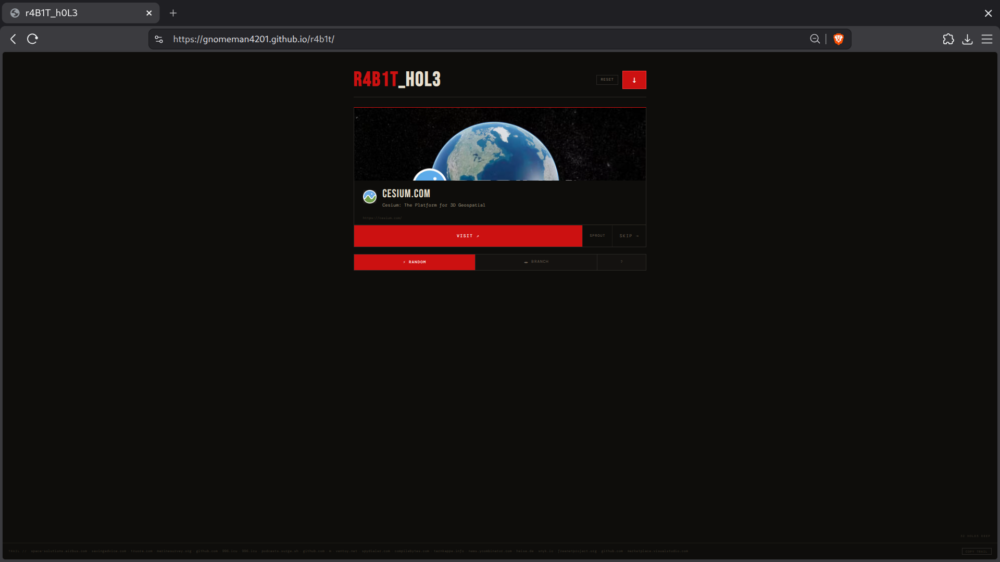

# R4B1T_H0L3

> Curated web discovery engine — 53,869 verified live URLs across security, OSINT, research, and the weird internet.

**[→ Launch the tool](https://gnomeman4201.github.io/r4b1t/)**

---

## Screenshots

<table>
<tr>
<td></td>
<td></td>
</tr>
<tr>
<td></td>
<td></td>
</tr>
</table>



---

## What it is

StumbleUpon for the security and OSINT community. Roll a random URL from a hand-curated pool of 53k+ verified live resources. Visit it, skip it, or SPROUT — generate four directional suggestions (deeper, sideways, opposite, weird) based on the page's semantic content.

No accounts. No tracking. No algorithm. Just the pool and the roll.

## How the pool was built

The URL corpus was assembled from:
- Start.me OSINT and security pages (scraped via Playwright/CDP)
- GitHub awesome-lists across 21 categories
- Manual curation passes with a two-stage liveness gate (automated HTTP sweep + human relevance sign-off)

Raw input: ~53,869 URLs. After deduplication, liveness sweep (HEAD requests, 10s timeout), and relevance filtering: **53,869 verified live URLs** across 14,488 unique domains. The sweep runs weekly via GitHub Actions and auto-commits the pruned pool.

## Features

- **RANDOM** — roll a verified live URL from the pool
- **BRANCH** — SPROUT generates four directional suggestions using OG metadata + Wikipedia API keyword extraction (zero API cost)
- **FILTER** — lock rolls to a category (CODE, OSINT, BLOG, NEWS, RESEARCH, BOUNTY, VIDEO, SOCIAL, REF, ARCHIVE, PKG, COURSE, EVENT, HARDWARE, TOR)
- **HISTORY** — full scrollable session history, clickable to revisit
- **SHARE CARD** — download a PNG card of your current rabbit hole
- **COPY TRAIL** — export session as markdown with clickable links and timestamps
- **SUBMIT URL** — suggest additions via pre-filled GitHub issue
- **PWA** — installable as a home screen app, offline shell cache
- **Dark/light mode** — warm light palette toggle, persists across sessions

## Keyboard shortcuts

| Key | Action |
|-----|--------|
| Space | Roll new URL |
| Enter | Visit current URL |
| S | Skip |
| P | Sprout branches |
| C | Download share card |
| ? or H | Toggle help |
| ESC | Close overlay |

## Architecture

Single-file vanilla JS/HTML/CSS — no framework, no build step. Cloudflare Worker backend handles OG metadata fetching (1hr edge cache), site proxy with RFC1918 blocking, rate limited at 60 req/min per IP, origin-locked.

## Pool management

```bash
python pool_sweep.py --workers 30 --timeout 8
sqlite3 pool_sweep.db "SELECT url FROM pool WHERE reachable=1" > pool_alive.txt
```

## Submit a URL

Found something worth adding? Click **SUBMIT URL** in the tool or [open an issue](https://github.com/GnomeMan4201/r4b1t/issues/new?labels=url-submission).

## Built by

[badBANANA Research Collective](https://github.com/GnomeMan4201) / GnomeMan4201

Part of the BANANA_TREE ecosystem of independent security research tooling.
