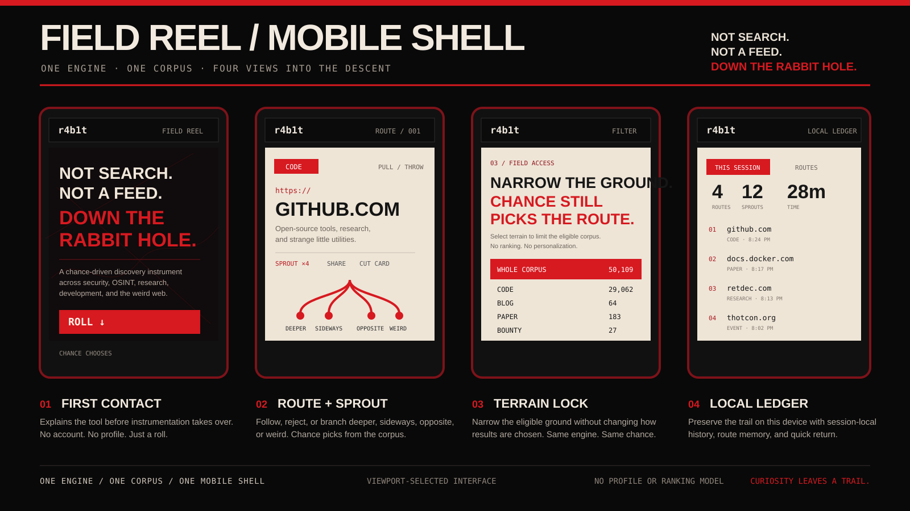
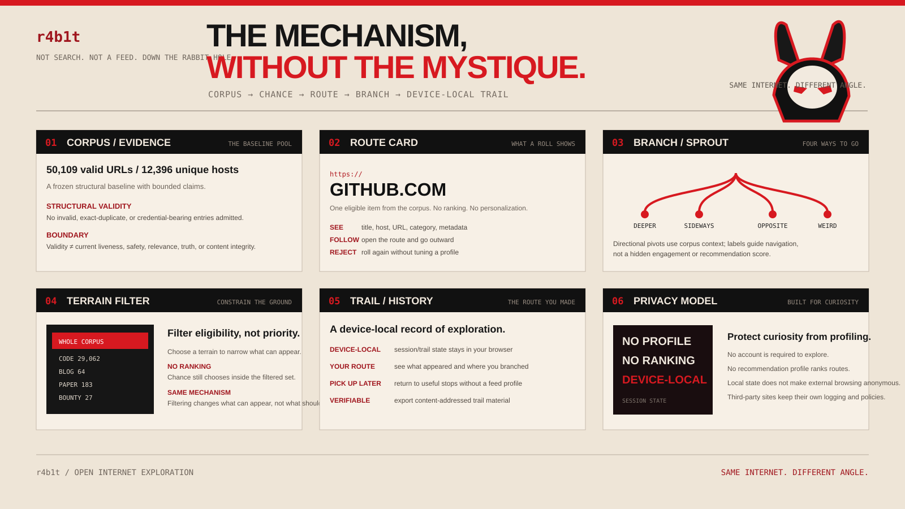

<p align="center">
  <a href="https://r4b1t.badbananaresearch.com">
    
  </a>
</p>

<p align="center">
  
</p>

<p align="center">
  
</p>

# r4b1t

<p align="center">
  <strong>Chance-driven discovery across security, OSINT, research, development, and the weird web.</strong><br>
  No recommendation profile. No engagement feed. No ranking model deciding what deserves to be next.
</p>

<p align="center">
  <a href="https://r4b1t.badbananaresearch.com"><strong>PROJECT SITE</strong></a>
  ·
  <a href="https://gnomeman4201.github.io/r4b1t/"><strong>LAUNCH r4b1t</strong></a>
  ·
  <a href="https://dev.to/gnomeman4201/r4b1th0l3-5aa3"><strong>DEV WRITE-UP</strong></a>
  ·
  <a href="https://github.com/GnomeMan4201/r4b1t/releases"><strong>RELEASES</strong></a>
</p>

<p align="center">
  <a href="https://github.com/GnomeMan4201/r4b1t/actions/workflows/test.yml"></a>
  <a href="https://github.com/GnomeMan4201/r4b1t/actions/workflows/corpus-quality.yml"></a>
  <a href="https://github.com/GnomeMan4201/r4b1t/actions/workflows/deploy.yml"></a>
  <a href="./LICENSE"></a>
  
  
</p>

---

## What this is

**r4b1t is a random-discovery instrument built around a curated corpus rather than a ranked feed.**

You roll the corpus. One route appears. You can follow it, reject it, inspect it, narrow the terrain, or branch away from it. The route you actually make can be preserved locally as a trail.

The point is not to compete with search. Search is good when you already know what you want. r4b1t is for the opposite situation: when you want to discover something useful, strange, adjacent, forgotten, or simply outside the path an engagement system would normally place in front of you.

```text
CORPUS → CHANCE → ROUTE → BRANCH → DEVICE-LOCAL TRAIL
```

### Design boundary

| r4b1t does | r4b1t does not |
| --- | --- |
| Surface an eligible route by chance | Rank results by popularity or predicted relevance |
| Let you narrow the eligible terrain | Build a recommendation profile |
| Preserve session/trail state locally | Require an account to explore |
| Offer directional branching | Turn branch labels into a hidden engagement score |
| Keep evidence claims bounded | Claim that structural validity proves safety or truth |

---

## Why I built it

Modern discovery is extremely good at narrowing.

Search engines optimize for relevance. Social feeds optimize for engagement. Recommendation systems learn what keeps you clicking. Those systems are useful, but they tend to keep exploration inside increasingly well-defined neighborhoods.

I wanted the other behavior back: **deliberate serendipity**.

The project started from the same hole StumbleUpon left behind, but the goal became more specific: build a discovery surface useful for security research, OSINT, development, research, and the stranger edges of the web without turning the user into another recommendation profile.

The original build notes and early design reasoning are documented in the DEV article:

> **[r4b1t_h0l3 — 53,000+ curated links for security and OSINT](https://dev.to/gnomeman4201/r4b1th0l3-5aa3)**

That article captures an earlier corpus revision. This repository and the current evidence surfaces are authoritative for the present implementation.

---

## The interaction model

### 01 / ROLL — chance chooses

A roll selects one eligible route from the current terrain. There is no ranked result page and no relevance score exposed as an ordering mechanism.

Immediate repetition and excessive domain repetition are constrained so randomness does not collapse into repeatedly showing the same host.

### 02 / FOLLOW or REJECT — you choose

A surfaced route is not an instruction.

You can follow it outward, inspect it, share/cut the card, or reject it and roll again. Refusal is part of the path rather than a negative signal used to tune a recommendation profile.

### 03 / SPROUT — branch without becoming a feed

From a route, **SPROUT** exposes four directional pivots:

| Direction | Intent |
| --- | --- |
| **DEEPER** | Stay near the current niche and drill further in |
| **SIDEWAYS** | Move into adjacent territory or shared context |
| **OPPOSITE** | Surface a contrasting direction or perspective |
| **WEIRD** | Intentionally take the low-signal, unexpected tangent |

Branch generation uses available page metadata and lightweight semantic signals against the existing corpus. The branch labels are navigational directions, not personalized recommendations.

### 04 / TERRAIN — narrow the ground

Filtering changes **what is eligible to appear**, not **what the system thinks should appear**.

Current terrain labels include:

`CODE` · `BLOG` · `NEWS` · `RESEARCH` · `PAPER` · `OSINT` · `BOUNTY` · `VIDEO` · `SOCIAL` · `REF` · `ARCHIVE` · `PKG` · `COURSE` · `EVENT` · `HARDWARE` · `TOR`

### 05 / TRAIL — keep the route you made

History is useful when it reflects your movement rather than a platform's model of you.

r4b1t keeps route/session state on the device so you can revisit what appeared, where you branched, and where you went next. There is no account requirement for this state.

---

## One engine, two shells

Desktop and mobile are **two presentations of the same application**, not separate discovery engines.

```text
                same corpus
                    │
              shared engine
                    │
          shared session state
                    │
          ┌─────────┴─────────┐
          │                   │
      > 900 px             ≤ 900 px
   workstation           field shell
          │                   │
          └─────────┬─────────┘
                    │
       roll / follow / sprout / filter
       history / trail / share / inspect
```

The viewport selects the shell. Crossing the breakpoint can switch presentation without replacing the underlying discovery state.

### Desktop / workstation

The larger interface keeps the exploratory workstation model: keyboard-first controls, expanded route context, branching surfaces, history, and trail tooling.

### Mobile / field shell

The phone interface is recomposed instead of simply shrinking the desktop UI. It emphasizes first-contact clarity, route cards, one-thumb controls, terrain selection, branching, and the local ledger.

---

## Corpus and evidence boundary

The corpus changes over time. Evidence should not.

The current frozen structural baseline is:

| Measurement | Baseline |
| --- | ---: |
| Structurally valid URLs | **50,109** |
| Unique hosts | **12,396** |
| Invalid entries admitted | **0** |
| Exact duplicates admitted | **0** |
| Credential-bearing entries admitted | **0** |

Baseline SHA-256:

```text
5d7339b8cbfe7bd35bb8502ca753e5b4663bc2fc4ba3721b23b791dbace01c41
```

### What that proves

It provides a reproducible structural count for that audited corpus revision and a cryptographic identifier for the source material being described.

### What that does not prove

Structural validity does **not** prove that a third-party URL is currently reachable, relevant, trustworthy, safe, unchanged, or correct.

Those are separate measurements. Liveness sweeps are time-bounded evidence; they do not rewrite an older frozen evidence record just because the web changed later.

### Corpus inputs

Corpus work has included:

- Start.me OSINT and security collections gathered through browser automation
- GitHub awesome-lists across 21 categories
- manual curation passes
- automated liveness sweeps
- human relevance review
- duplicate, credential, and policy checks before evidence-bound revisions are promoted

---

## Verifiable trails

r4b1t can export content-addressed trail material without requiring a server-side identity record.

The trail work separates **what can be cryptographically verified** from stronger claims the artifact cannot support.

A verified reveal can establish that disclosed route material matches its commitment. It does not, by itself, establish authorship or prove real-world wall-clock ordering.

Relevant architecture decisions:

- [`ADR 0001 — Anti-ranking boundary`](./docs/adr/0001-anti-ranking-boundary.md)
- [`ADR 0002 — Content-addressed trails`](./docs/adr/0002-content-addressed-trails.md)
- [`ADR 0003 — Blind Descent commit/reveal`](./docs/adr/0003-blind-descent-commit-reveal.md)

Verify an exported trail locally:

```bash
npm run trail:verify -- trail.json
```

Verify a child and declared parent together:

```bash
npm run trail:verify -- child.json parent.json
```

---

## Architecture

The production browser client is intentionally lightweight and framework-free.

```text
                         r4b1t
                           │
                   vanilla browser client
                           │
              ┌────────────┴────────────┐
              │                         │
       desktop workstation        mobile field shell
              │                         │
              └────────────┬────────────┘
                           │
                corpus + session state
                           │
              optional metadata services
```

Core surfaces include static HTML/CSS/JavaScript, PWA/service-worker support, trail/topology runtimes, Playwright regression tests, and corpus maintenance tooling. Node.js exists primarily for development and verification tooling rather than as an application build requirement.

---

## Quick start

### Launch the deployed application

**https://gnomeman4201.github.io/r4b1t/**

The custom project front door is:

**https://r4b1t.badbananaresearch.com**

### Run locally

```bash
git clone https://github.com/GnomeMan4201/r4b1t.git
cd r4b1t
python3 -m http.server 8080
```

Then open:

```text
http://127.0.0.1:8080/
```

Some metadata/preview behavior can depend on deployed services, so a bare static server is not identical to production. It is still suitable for the primary client, PWA shell, navigation, corpus, and interface regression work.

---

## Tests and verification

Install development dependencies and the Chromium test target:

```bash
npm ci
npx playwright install chromium
npm test
```

The repository maintains dedicated workflow surfaces for:

- browser regression testing
- corpus-quality checks
- deployment
- pool/liveness maintenance
- dependency auditing

The browser suite covers both desktop and mobile behavior, including shell selection, viewport switching, roll propagation, filtering, branching, route fidelity, overflow containment, trail behavior, Blind Descent leak prevention, and topology/tamper cases.

A green test workflow verifies the paths tested for that revision. It does **not** certify the safety or continued availability of every external destination in the corpus.

---

## Repository map

| Surface | Purpose |
| --- | --- |
| `index.html` / `r4b1t.html` | Application entry surfaces |
| `dual-shell.js` / `dual-shell.css` | Shared responsive shell behavior |
| `trail-runtime.js` / `trail-manifest.js` | Trail state and export/verification support |
| `trail-topology.js` / `topology-runtime.js` | Trail topology and lineage surfaces |
| `blind-runtime.js` / `blind-manifest.js` | Blind Descent commit/reveal behavior |
| `trail-wear.js` / `trail-wear.css` | Persistent visual trail-wear layer |
| `pool_sweep.py` | Time-bounded liveness/pool maintenance workflow |
| `urls.txt` | Corpus route material |
| `tests/` | Browser and regression coverage |
| `docs/adr/` | Architectural decisions and trust boundaries |

---

## Privacy model

r4b1t deliberately minimizes what the application itself needs to know about you.

- no r4b1t account required for exploration
- no recommendation profile used to rank routes
- route/session state is designed to remain device-local
- the core selection loop does not require a personalized server-side feed

This boundary stops at the destination.

When you follow a route to a third-party site, that destination operates under **its own** logging, cookies, analytics, authentication, privacy policy, security posture, and legal terms. Device-local state inside r4b1t does not make external browsing anonymous.

---

## Trust, external content, and liability

> **r4b1t curates pointers. It does not control the destinations those pointers lead to.**

The corpus contains references to independent third-party resources. Inclusion in the corpus is **not** an endorsement, certification, guarantee of safety, or statement that a resource remains unchanged after review.

In particular:

- a structurally valid URL can later disappear, redirect, expire, be repurposed, or change ownership
- a successful liveness check does not establish trustworthiness or content integrity
- category and branch labels are navigation aids, not legal, security, or factual classifications
- external sites may collect network, browser, account, or behavioral information according to their own policies
- users are responsible for evaluating third-party content before downloading, executing, authenticating to, or otherwise relying on it

The software itself is distributed under the MIT License and is provided **"AS IS"**, without warranty of any kind, as described in [`LICENSE`](./LICENSE).

If a vulnerability is in **r4b1t itself**, use the process in [`SECURITY.md`](./SECURITY.md). Vulnerabilities belonging to third-party destinations should be reported to the relevant owner rather than treated as a vulnerability in this project.

---

## Project links

| Resource | Link |
| --- | --- |
| Project site | **[r4b1t.badbananaresearch.com](https://r4b1t.badbananaresearch.com)** |
| Live application | **[gnomeman4201.github.io/r4b1t](https://gnomeman4201.github.io/r4b1t/)** |
| Original DEV write-up | **[r4b1t_h0l3](https://dev.to/gnomeman4201/r4b1th0l3-5aa3)** |
| DEV profile | **[dev.to/gnomeman4201](https://dev.to/gnomeman4201)** |
| Releases | **[GitHub Releases](https://github.com/GnomeMan4201/r4b1t/releases)** |
| Changelog | **[CHANGELOG.md](./CHANGELOG.md)** |
| Issues / URL submissions | **[GitHub Issues](https://github.com/GnomeMan4201/r4b1t/issues)** |
| Contributing | **[CONTRIBUTING.md](./CONTRIBUTING.md)** |
| Security | **[SECURITY.md](./SECURITY.md)** |

---

## Contributing

Useful contributions include corpus-quality fixes, broken-link reports, reproducible UI bugs, accessibility problems, evidence/verification corrections, and well-scoped improvements that preserve the project's anti-ranking boundary.

Start with [`CONTRIBUTING.md`](./CONTRIBUTING.md). For a new corpus candidate, use the repository issue flow rather than silently changing evidence-bound material.

---

## License

MIT. See [`LICENSE`](./LICENSE).

---

## Built by

**badBANANA Research Collective / [GnomeMan4201](https://github.com/GnomeMan4201)**

Research notes and technical writing: **[dev.to/gnomeman4201](https://dev.to/gnomeman4201)**

<p align="center"><strong>NOT SEARCH. NOT A FEED. DOWN THE RABBIT HOLE.</strong></p>
